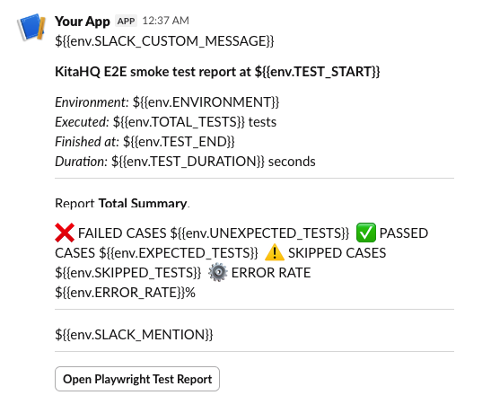

# playwright-fokuslah
Automated testing for fokuslah application using Playwright with Page Object Model pattern.

## 🎯 Features

- **Playwright E2E Testing**: Comprehensive test automation using Playwright
- **Page Object Model**: Clean and maintainable test structure with POM pattern
- **TypeScript Support**: Type-safe test development
- **AI Integration**: OpenAI integration for enhanced testing capabilities
- **Test Data Management**: Faker.js for dynamic test data generation
- **Code Quality Tools**: ESLint and Prettier with pre-commit hooks

## 🛠️ Installation

```bash
npm install
npx playwright install
```

## 📖 Usage

### Running Tests

```bash
# Run all tests in headless mode
npm test --project=ENV_TYPE

# Run specific test file (option 1)
npx playwright test tests/auth/login.spec.ts --project=ENV_TYPE

# Run all test (option 2 - with npm)
npm run test:dev
```
### Viewing Test Reports

```bash
# Show test report
npm run test:report
```

### Slack block kit builder (example)
